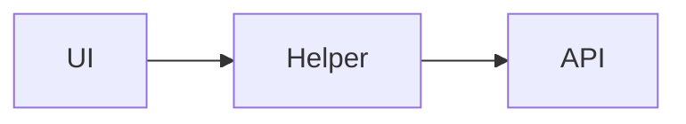

# Solve / Plan pattern (LDA-PO) — every task

**Locked for `/super-spec` / OpenSpec / CreatePlan / `task_plan.md`.**  
After chat review (2026-07-30): every solve and plan must show this structure — not only edit-lock.

**Example of a reviewed portal plan:** [pl-db-edit-lock-portal.md](pl-db-edit-lock-portal.md)

---

## When

| Mode | Required? |
|------|-----------|
| Standard / Thorough plan | Full LDA-PO sections |
| Quick (1-file bug / typo) | **Compressed** LDA-PO (5 short bullets OK) |
| Pure Q&A / no code | Skip |
| User says `skip pattern` | Skip only if they insist |

Apply at **Phase 1–2** (spec → plan) and in Cursor **CreatePlan** before G1 confirm. Re-check at **G2**.

---

## LDA-PO sections (required)

### 1. Logic
- Rules that decide behavior (status gates, permissions, when block/allow).
- Happy path + fail path in plain words.
- Must vs nice (what is required for the bug/feature).

### 2. Data structure
- Where truth lives (DB columns, API payload keys, Vue reactive fields).
- Tables or short maps: field → source → consumer.
- Status / enum values that matter (`PND` / `APV` / …).

### 3. Architecture
- Who calls whom (Detail / Form / Service / API).
- Prefer a small mermaid flowchart for Standard+.
- Where the change sits (new slice vs shared thin branch).

### 4. Portal (reuse)
- **One shared helper/module** others can call later? Name path + API shape.
- Or: reuse existing portal (`scope.js`, `edit-lock.js`, vendor service) — **no second gate**.
- If no portal yet: say “none — local only” and why (must / YAGNI).

### 5. Others
- Scope in/out (Direct Book only? legacy off?).
- Rollout (now vs later).
- Toast / errors / verify / deploy notes.
- Risks + what is **not** last forever.

---

## Template (paste into every plan)

```markdown
## Logic
- …

## Data structure
| Concept | Where | Notes |
|---------|-------|-------|
| … | … | … |

## Architecture

- …

## Portal
- File: `path/to/shared.js` (or none)
- Reuse later: quote / policy / …

## Others
- Scope: …
- Now / later: …
- Verify: …
```

---

## Quick compress (example)

```markdown
## LDA-PO
- **Logic:** …
- **Data:** …
- **Arch:** Form → helper → API
- **Portal:** `burglary/edit-lock.js` (reuse) / none
- **Others:** DB only; smoke URL X
```

---

## Gate checks

### G1 (spec) — add
- [ ] Spec or explore notes name **rules** (Logic) and **where data lives** (Data) in plain language
- [ ] No silent “hide button only” for security/status bugs

### G2 (plan) — add
- [ ] Plan has **Logic / Data structure / Architecture / Portal / Others** (full or Quick compress)
- [ ] Portal section either points to one shared file **or** explicitly says none + why
- [ ] Architecture names files to Create/Modify

### CreatePlan / reply to user
- Same five headings before asking user to approve
- Caveman OK — keep headings; shorten bullets

---

## Anti-patterns

| Bad | Good |
|-----|------|
| Plan = file list only | LDA-PO then tasks |
| Hide UI = “fixed” | Logic + API lock |
| Copy-paste gate in 3 Forms | Portal one file |
| Skip data map | Table of status/payload fields |
| Expand all phases “while here” | Others: now vs later |

---

## Coexistence

- Does **not** replace OpenSpec artifacts (`proposal` / `tasks.md`) — **adds** LDA-PO inside plan / CreatePlan body.
- Works with `simple-code-voice`, `srp-thin`, PL seven-product scope, `14-code-must-benefit`.
- Domain example (edit URL lock): [pl-db-edit-lock-portal.md](pl-db-edit-lock-portal.md).
