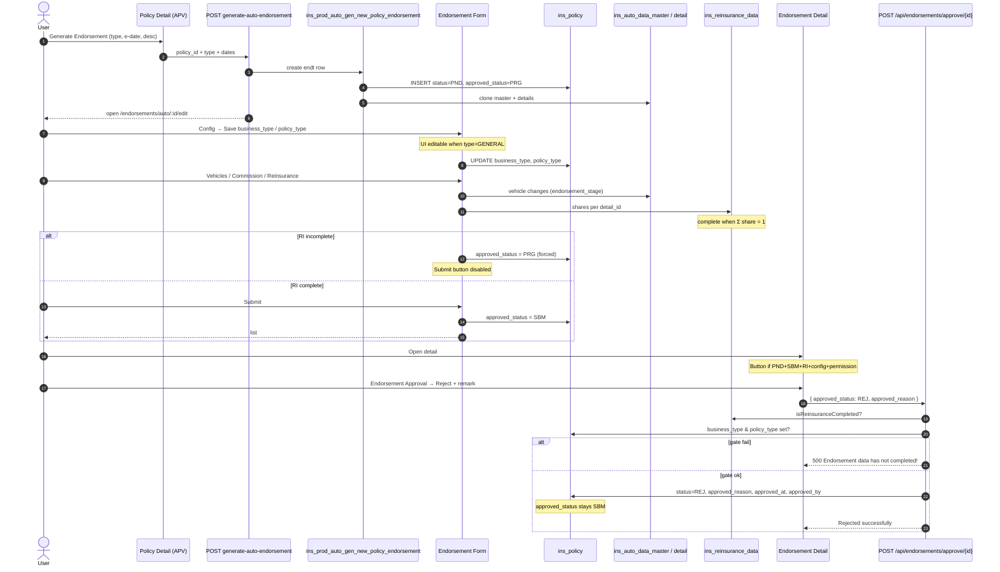
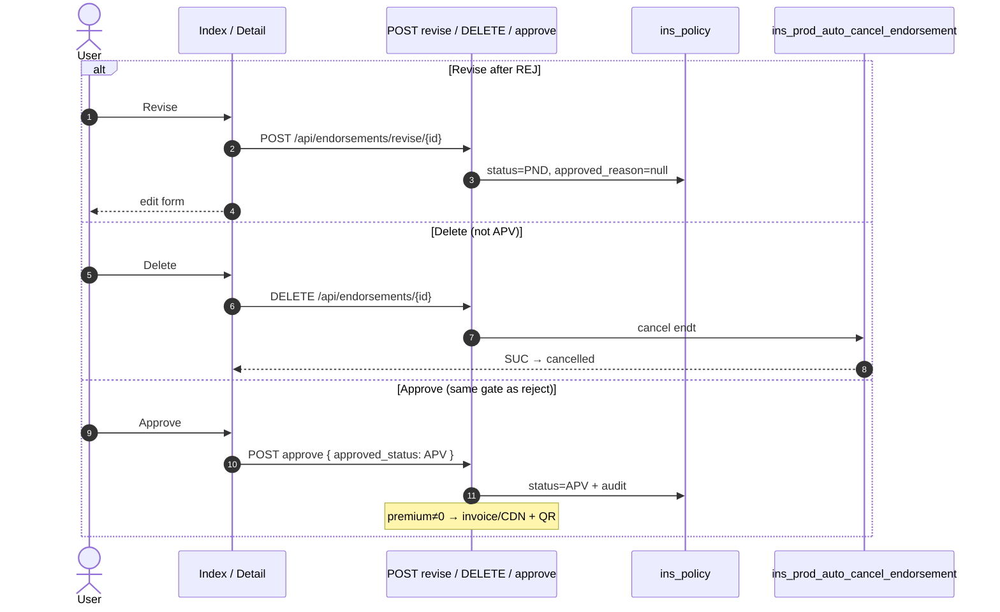

# Auto Endorsement — Full User Journey

**Product:** Auto · **Module:** Endorsement  
**URLs:** `/endorsements/auto` · edit `/endorsements/auto/:id/edit` · detail `/endorsements/auto/:id`  
**Generate from:** approved Auto policy → Generate Endorsement

---

## 1. Journey overview

```text
[APV Policy]
    │ Generate Endorsement (type + e-date + desc)
    ▼
[PND · approved_status usually PRG]
    │ Edit tabs: Info / Vehicles / Deductible / Config / Commission / Reinsurance
    │ (± Cancellation / Endorsement Info by type)
    │
    ├─ Incomplete RI → Submit disabled · forced PRG
    ├─ RI complete → Submit enabled
    │
    │ Submit (SBM)
    ▼
[PND · SBM]
    │ Detail: Approve button ONLY if:
    │   · ENDORSEMENT.APPROVE permission
    │   · RI complete
    │   · business_type + policy_type complete
    │   · status=PND AND approved_status=SBM
    │
    ├─ Approve (APV) ──► invoice/CDN/QR if premium ≠ 0 ──► print / next generate
    ├─ Reject  (REJ) ──► revise → PND ──► edit again
    └─ Delete (cancel SP) if not APV
```

---

## 2. What the user can do (step table)

| Step | User action | When allowed | API | Main table / columns |
|------|-------------|--------------|-----|----------------------|
| **1 Generate** | From APV policy → Generate Endorsement | Policy `status=APV` | `POST /api/policies/generate-auto-endorsement/{policy}` | SP `ins_prod_auto_gen_new_policy_endorsement` → new `ins_policy` + `ins_auto_data_master` clone; sets `endorsement_type` |
| **2 Edit Info** | Policy info / GENERAL fields | `status=PND` + UPDATE | Auto form routes | `ins_auto_data_master` |
| **3 Vehicles** | Add / delete / amend vehicles | `status=PND` | vehicle endpoints | `ins_auto_data_detail` (`endorsement_stage` = document_no) |
| **4 Deductible** | Deductible tab | edit mode | deductible APIs | deductible tables |
| **5 Config** | Save Business / Policy Type | **GENERAL only** (UI); others often copied at gen | `PUT /api/endorsements/{id}` | **`ins_policy.business_type`**, **`ins_policy.policy_type`** |
| **6 Commission** | Commission rows | edit | commission APIs | `ins_policy_commission_data` (`policy_id` = endt id) |
| **7 Reinsurance** | Fill RI shares until 100% | edit | RI APIs | **`ins_reinsurance_data`** (`policy_id`, `endorsement_stage`, `share`, `detail_id`) |
| **8 Submit** | Submit button | RI complete (else disabled / forced PRG) | `PUT /endorsement-service/update-submit-status/{id}` `{status:'SBM'}` | **`ins_policy.approved_status` = `SBM`** |
| **9 Approve** | Dialog → Approve | See gate below | `POST /api/endorsements/approve/{id}` | **`ins_policy.status` = `APV`** + audit; invoice if premium ≠ 0 |
| **10 Reject** | Dialog → Reject + remark | **Same gate as Approve** | same approve API `{approved_status:'REJ'}` | **`ins_policy.status` = `REJ`**, `approved_reason`, `approved_at`, `approved_by` |
| **11 Revise** | List revise | `status=REJ` + REVISE | `POST /api/endorsements/revise/{id}` | `status=PND`, `approved_reason=null` |
| **12 Delete** | Cancel endorsement | not `APV` + DELETE | `DELETE /api/endorsements/{id}` | SP `ins_prod_auto_cancel_endorsement` |
| **13 Print** | Endorsement / Invoice / CDN / Certificate | print rules | `/endorsement-service/.../download-*` | read |
| **14 Next endt** | Generate again from this endt | current `status=APV` | `POST /api/endorsements/generate-auto-endorsement/{id}` | same SP as step 1 |

**Endorsement types** (`ins_auto_data_master.endorsement_type`):

`GENERAL` · `ADD/DELETE` · `CANCELLATION` · `RE_INVOICE` · `CUSTOM` · `AMEND_ENDT_PREMIUM` · `AMEND_SUM_INSURED_PREMIUM`

---

## 3. Approve / Reject gate (exact)

The **Endorsement Approval** button shows only when **all** are true:

| # | Gate | Where | Table / column |
|---|------|-------|----------------|
| 1 | Permission `ENDORSEMENT.APPROVE` | FE | — |
| 2 | Reinsurance complete | FE + BE | `ins_reinsurance_data`: `policy_id` = endt id, `endorsement_stage` = `document_no`, **Σ `share` = 1** per `detail_id` |
| 3 | Config complete | FE + BE | **`ins_policy.business_type`** AND **`ins_policy.policy_type`** both set |
| 4 | Pending | FE | **`ins_policy.status` = `PND`** |
| 5 | Submitted | FE | **`ins_policy.approved_status` = `SBM`** |

Backend (`EndorsementController::approve`) re-checks RI + config. Fail → `"Endorsement data has not completed!"`.

Also: UW authority limit check before dialog (warn / hard-block category).

**Reject uses the same button and same gates** — choose `REJ` in the dialog.

### Reject writes

| Table | Columns updated |
|-------|-----------------|
| **`ins_policy`** | `status` → `REJ`, `approved_reason`, `approved_at`, `approved_by` |
| | `approved_status` **unchanged** (stays `SBM`) |

**Payload trap:** FE sends `approved_status: "REJ"` → BE maps to column **`status`**, not `approved_status`.

---

## 4. Tables & columns cheat sheet

### `ins_policy` (Endorsement row)

| Column | Role |
|--------|------|
| `id` | Endorsement pk (URL `:id`) |
| `data_id` | → `ins_auto_data_master.id` |
| `document_no` | Endorsement document no (= RI `endorsement_stage`) |
| `status` | Lifecycle: `PND` → `APV` / `REJ` |
| `approved_status` | Submit gate: `PRG` / `SBM` (**not** flipped by reject) |
| `approved_reason` | Reject / approve remark |
| `approved_at` / `approved_by` | Audit |
| `business_type` | Config gate |
| `policy_type` | Config gate |
| `version` / `cycle` | Versioning |

### `ins_auto_data_master`

| Column | Role |
|--------|------|
| `id` | = `ins_policy.data_id` |
| `endorsement_type` | Type of this endt |
| `endorsement_e_date` | Effective date |

### `ins_auto_data_detail`

| Column | Role |
|--------|------|
| `master_data_id` | Master |
| `endorsement_stage` | = endt `document_no` for changed vehicles |
| `status` | ACT / DEL |
| `premium` / `vehicle_value` | Premium / certificate |

### `ins_reinsurance_data` (RI gate)

| Column | Role |
|--------|------|
| `policy_id` | = endt `ins_policy.id` |
| `detail_id` | Vehicle detail |
| `endorsement_stage` | = `document_no` |
| `endorsement_state` | ADDITION / DELETION / CANCEL / … |
| `share` | Must sum to **1.0** per `detail_id` |

### `ins_policy_commission_data`

| Column | Role |
|--------|------|
| `policy_id` | Endt id |
| `detail_id` | Vehicle |

---

## 5. Status matrix

| `status` | `approved_status` | User can |
|----------|-------------------|----------|
| `PND` | `PRG` (or empty) | Edit tabs · Submit when RI ok · Delete |
| `PND` | `SBM` | Approve **or** Reject (if RI + config) · Delete |
| `APV` | (unchanged) | Print · Generate next endt · **no** edit / delete / approve |
| `REJ` | (still SBM typically) | Revise → `PND` · Delete |

---

## 6. Sequence — full path + reject



---

## 7. Sequence — revise / delete / approve



---

## 8. Verify SQL

```sql
-- Endorsement row
SELECT id, document_no, data_id, status, approved_status,
       business_type, policy_type, approved_reason, approved_at, approved_by
FROM ins_policy
WHERE id = :endt_id;

-- Config gate
SELECT (business_type IS NOT NULL AND policy_type IS NOT NULL) AS config_ok
FROM ins_policy WHERE id = :endt_id;

-- RI gate (shares must = 1 per detail_id for this stage)
SELECT detail_id, SUM(share) AS total_share
FROM ins_reinsurance_data
WHERE policy_id = :endt_id
  AND endorsement_stage = :document_no
GROUP BY detail_id;

-- Master type
SELECT id, endorsement_type, endorsement_e_date
FROM ins_auto_data_master
WHERE id = (SELECT data_id FROM ins_policy WHERE id = :endt_id);
```

---

## 9. vs Auto Quotation reject

| | Quotation | Endorsement |
|--|-----------|-------------|
| Table | `ins_quotation` | `ins_policy` |
| Reject column | `approved_status` or `accepted_status` | **`status`** |
| Submit column | n/a (two steps) | `approved_status` = PRG / SBM |
| Accept step | Yes | **No** |
| Extra gates | UW only | RI + business/policy type + SBM |

---

## 10. Code pointers

| Layer | Path |
|-------|------|
| Detail UI + gates | `resources/js/views/Endorsement/Detail.vue` |
| Edit / Submit | `resources/js/views/Endorsement/Form.vue` |
| Config tab | `resources/js/views/Policy/FormTabs/Config.vue` |
| Approve / Revise / Delete | `app/Http/Controllers/Insurance/EndorsementController.php` |
| Submit status / RI check | `app/Http/Controllers/Insurance/EndorsementServiceController.php` |
| Model | `app/Models/Insurance/Endorsement/Endorsement.php` → table `ins_policy` |
| RI complete | `app/Models/Insurance/ReinsuranceData.php` → table `ins_reinsurance_data` |

---

*Source markdown also at `docs/diagrams/auto-hs-reject-flow.md` · Generated for ops / UAT / onboarding.*
