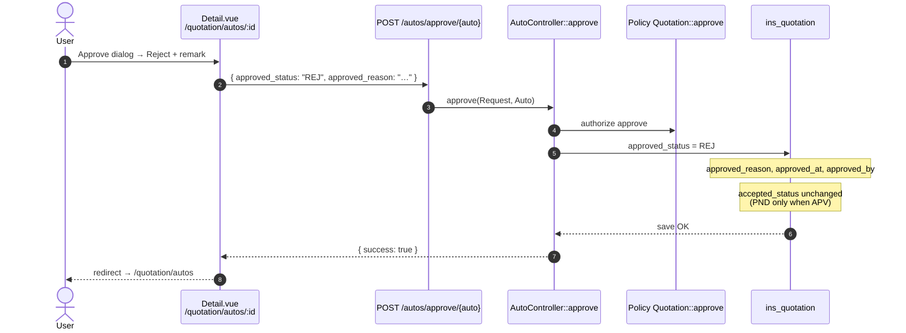
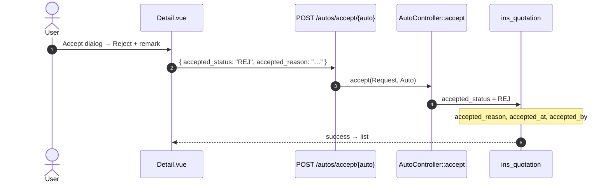
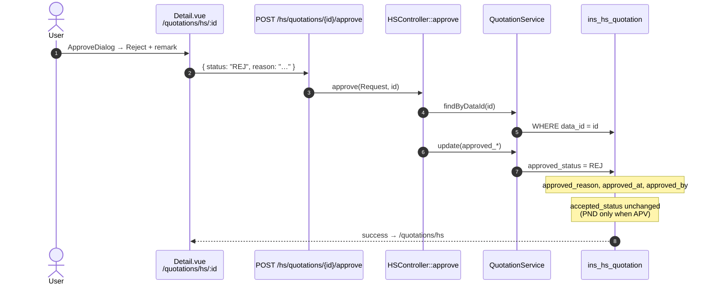
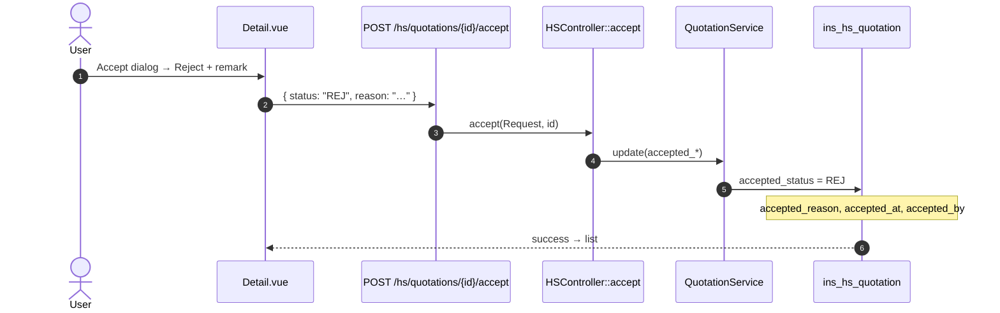
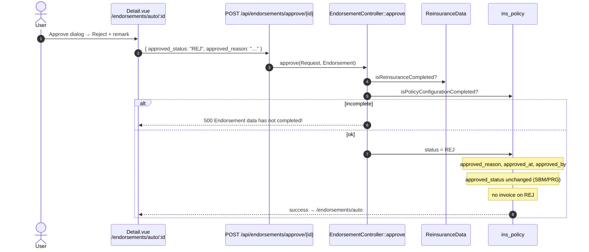
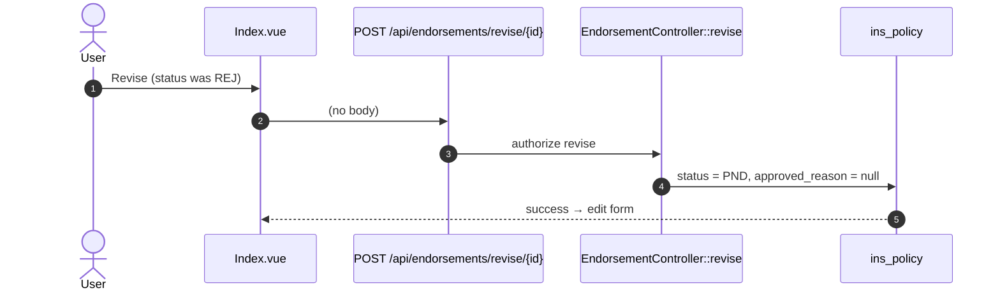
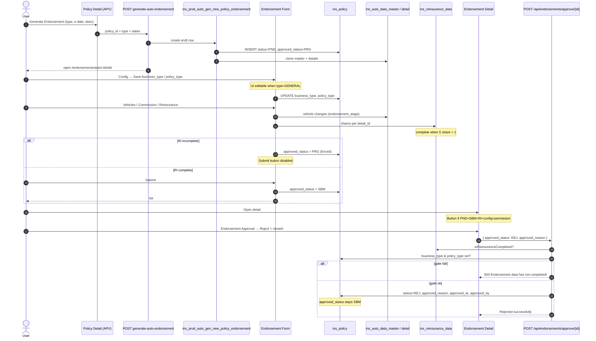
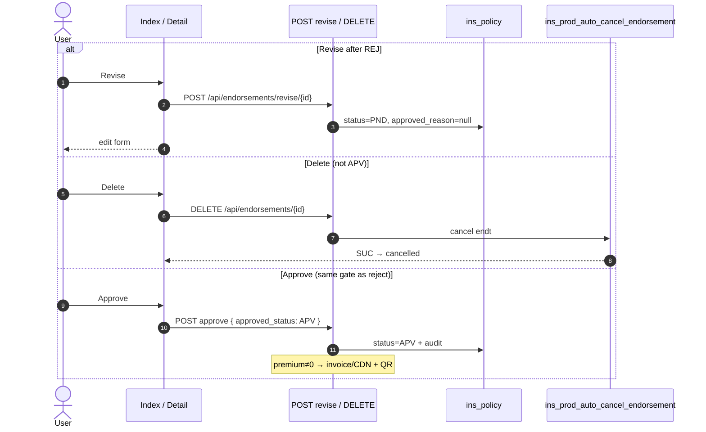

# Auto & HS — Quotation Reject Flow

Sequence diagrams for **underwriter reject** (approve step) and **accept-step reject** on quotation detail screens.

| Product | List URL | Detail URL |
|---------|----------|------------|
| Auto | `/quotation/autos` | `/quotation/autos/:id` |
| HS | `/quotations/hs` | `/quotations/hs/:id` |

**Export to PDF:** paste any diagram into [Mermaid Live](https://mermaid.live) → Actions → PDF, or print this page.

---

## Auto — UW reject (approve step)



**Code:** `resources/js/views/Quotation/Auto/Detail.vue` → `app/Http/Controllers/Quotation/AutoController.php` → `App\Models\Insurance\Quotation` (`ins_quotation`).

---

## Auto — accept-step reject



**Revise (Auto only):** `PUT /autos/revise-approval-status/{id}` → `approved_status = PND`, `approved_reason = null`  
**Link:** `ins_quotation.data_id` = `ins_auto_data_master.id`

---

## HS — UW reject (approve step)



**Code:** `resources/js/views/Quotation/HS/Detail.vue` → `app/Http/Controllers/Quotation/HSController.php` → `App\Models\HS\Quotation` (`ins_hs_quotation`).

---

## HS — accept-step reject



**Link:** `ins_hs_quotation.data_id` = `ins_hs_data_master.id`  
**Extra:** maker cannot approve own record → HTTP 403  
**No** quotation revise route (unlike Auto).

---

## Side-by-side

| | **Auto** | **HS** |
|---|---|---|
| **Table** | `ins_quotation` | `ins_hs_quotation` |
| **Master link** | `data_id` → `ins_auto_data_master` | `data_id` → `ins_hs_data_master` |
| **Approve API** | `POST /autos/approve/{auto}` | `POST /hs/quotations/{id}/approve` |
| **Accept API** | `POST /autos/accept/{auto}` | `POST /hs/quotations/{id}/accept` |
| **Payload keys** | `approved_status` / `accepted_status` + `*_reason` | `status` + `reason` |
| **Revise** | Yes (`revise-approval-status`) | No |

---

## Verify query (after reject)

```sql
-- Auto
SELECT approved_status, approved_reason, accepted_status, accepted_reason
FROM ins_quotation WHERE data_id = :auto_master_id;

-- HS
SELECT approved_status, approved_reason, accepted_status, accepted_reason
FROM ins_hs_quotation WHERE data_id = :hs_master_id;
```

Status codes: `PND` | `APV` / `ACP` | `REJ`

---

# Auto Endorsement — Reject Flow

URL: `/endorsements/auto` · detail `/endorsements/auto/:id`

**One approve step only** (no accept step). Reject writes **`ins_policy`**.

| UI action | API | Col → `REJ` | Remark | Audit |
|---|---|---|---|---|
| Approve dialog → Reject | `POST /api/endorsements/approve/{id}` | **`status`** | `approved_reason` | `approved_at`, `approved_by` |

**Payload key trap:** FE sends `approved_status: "REJ"` but BE maps it to column **`status`**, not `approved_status`.

| Column | Role |
|---|---|
| `status` | Approve/reject outcome: `PND` / `APV` / `REJ` |
| `approved_status` | Submit gate: `PRG` / `SBM` (unchanged on reject) |
| `approved_reason` | Reject remark |

**Pre-check (both APV + REJ):** reinsurance complete + `business_type` / `policy_type` set. Else 500 `"Endorsement data has not completed!"`.

**On APV only:** invoice/credit note + QR. **On REJ:** status/reason/audit only — no invoice.

**Revise:** `POST /api/endorsements/revise/{id}` → `status = PND`, `approved_reason = null`

**Link:** `ins_policy.data_id` → `ins_auto_data_master.id` · EndorsementScope = versioned rows (not original policy).

---

## Auto Endorsement — sequence





---

## Verify query (Auto endorsement)

```sql
SELECT
  id,
  document_no,
  data_id,
  status,              -- REJ after reject
  approved_status,     -- still SBM (submit) — not flipped by reject
  approved_reason,
  approved_at,
  approved_by
FROM ins_policy
WHERE id = :endorsement_id;
```

```sql
-- after reject
UPDATE ins_policy SET
  status          = 'REJ',
  approved_reason = :reason,
  approved_at     = NOW(),
  approved_by     = :user_id
WHERE id = :endorsement_id;
```

---

# Auto Endorsement — Full User Journey

URL: `/endorsements/auto` · edit `/endorsements/auto/:id/edit` · detail `/endorsements/auto/:id`  
Generate starts from **approved Auto policy** (`/policies/...` → Generate Endorsement).

---

## 1. Journey map (what user can do)

```text
[APV Policy]
    │ Generate Endorsement (type + e-date + desc)
    ▼
[PND · approved_status usually PRG]
    │ Edit tabs: Info / Vehicles / Deductible / Config / Commission / Reinsurance
    │ (± Cancellation / Endorsement Info by type)
    │
    ├─ Incomplete RI → Submit disabled · forced PRG
    ├─ RI complete → Submit enabled
    │
    │ Submit (SBM)
    ▼
[PND · SBM]
    │ Detail: Approve button ONLY if:
    │   · ENDORSEMENT.APPROVE permission
    │   · RI complete
    │   · business_type + policy_type set
    │   · status=PND AND approved_status=SBM
    │
    ├─ Approve (APV) ──► invoice/CDN/QR if premium ≠ 0 ──► print / next generate
    ├─ Reject  (REJ) ──► revise → PND ──► edit again
    └─ Delete (cancel SP) if not APV
```

| Step | User action | When allowed | API | Main table / cols |
|------|-------------|--------------|-----|-------------------|
| **1 Generate** | From APV policy → Generate Endorsement | Policy `status=APV` | `POST /api/policies/generate-auto-endorsement/{policy}` | SP `ins_prod_auto_gen_new_policy_endorsement` creates new `ins_policy` row + `ins_auto_data_master` clone; sets `auto.endorsement_type` |
| **2 Edit Info** | Policy info / GENERAL fields | `status=PND` + UPDATE | Auto form routes | `ins_auto_data_master` |
| **3 Vehicles** | Add / delete / amend vehicles | `status=PND` | vehicle endpoints | `ins_auto_data_detail` (`endorsement_stage` = document_no) |
| **4 Deductible** | Deductible tab | edit mode | deductible APIs | deductible tables |
| **5 Config** | Save Business / Policy Type | **GENERAL only** (UI); non-GENERAL often copied at gen | `PUT /api/endorsements/{id}` | **`ins_policy.business_type`**, **`ins_policy.policy_type`** |
| **6 Commission** | Commission rows | edit | commission APIs | `ins_policy_commission_data` (`policy_id` = endt id) |
| **7 Reinsurance** | Fill RI shares until 100% | edit | RI APIs | **`ins_reinsurance_data`** (`policy_id`, `endorsement_stage`, `share`, `detail_id`) |
| **8 Submit** | Submit button | RI complete (else disabled / forced PRG) | `PUT /endorsement-service/update-submit-status/{id}` `{status:'SBM'}` | **`ins_policy.approved_status` = `SBM`** |
| **9 Approve** | Dialog → Approve | See gate below | `POST /api/endorsements/approve/{id}` `{approved_status:'APV', approved_reason}` | **`ins_policy.status` = `APV`** + audit; invoice if premium ≠ 0 |
| **10 Reject** | Dialog → Reject + remark | **Same gate as Approve** | same approve API `{approved_status:'REJ', …}` | **`ins_policy.status` = `REJ`**, `approved_reason`, `approved_at`, `approved_by` |
| **11 Revise** | List/Detail revise | `status=REJ` + REVISE | `POST /api/endorsements/revise/{id}` | `status=PND`, `approved_reason=null` |
| **12 Delete** | Cancel endorsement | not `APV` + DELETE | `DELETE /api/endorsements/{id}` | SP `ins_prod_auto_cancel_endorsement` |
| **13 Print** | Endorsement / Invoice / CDN / Certificate | print rules | `/endorsement-service/.../download-*` | read |
| **14 Next endt** | Generate again from this endt | current `status=APV` | `POST /api/endorsements/generate-auto-endorsement/{id}` | same SP as step 1 |

Endorsement types (`ins_auto_data_master.endorsement_type`): `GENERAL` · `ADD/DELETE` · `CANCELLATION` · `RE_INVOICE` · `CUSTOM` · `AMEND_ENDT_PREMIUM` · `AMEND_SUM_INSURED_PREMIUM`

---

## 2. Approve / Reject gate (exact)

**UI** (`Detail.vue` `canApproveCond`) shows button only when **all** true:

1. Permission `ENDORSEMENT.APPROVE`
2. `isReinsuranceCompleted` = true  
   → `GET /endorsement-service/is-endorsement-reinsurance-completed/{id}`  
   → `ReinsuranceData::isReinsuranceCompleted(policy_id, document_no)`  
   → each `detail_id` under stage has **sum(share) = 1**
3. `isConfigCompleted` = true  
   → `GET /policy-service/is-policy-configuration-completed/{id}`  
   → `ins_policy.business_type` **AND** `ins_policy.policy_type` both set
4. `ins_policy.status = 'PND'`
5. `ins_policy.approved_status = 'SBM'`

**BE** (`EndorsementController::approve`) re-checks (1)+(2)+(3) style: RI + config. Missing → `"Endorsement data has not completed!"`.

Also: UW authority limit check before dialog (warn / hard reject category).

**Reject uses the same button + same gates** as Approve — choose `REJ` in dialog.

---

## 3. Tables & columns cheat sheet

### Core — `ins_policy` (Endorsement model)

| Column | Role in journey |
|--------|-----------------|
| `id` | Endorsement pk (URL `:id`) |
| `data_id` | → `ins_auto_data_master.id` |
| `document_no` | Endorsement document no (= RI `endorsement_stage`) |
| `status` | Lifecycle: `PND` → `APV` / `REJ` (delete via cancel SP) |
| `approved_status` | Submit gate: `PRG` / `SBM` (**not** flipped by reject) |
| `approved_reason` | Reject/approve remark |
| `approved_at` / `approved_by` | Audit on approve/reject |
| `business_type` | Config gate |
| `policy_type` | Config gate |
| `version` / `cycle` | Endorsement versioning |
| `quotation_id` / `policy_no` | Link back to original |

### Master — `ins_auto_data_master`

| Column | Role |
|--------|------|
| `id` | = `ins_policy.data_id` |
| `endorsement_type` | Type of this endt |
| `endorsement_e_date` | Effective date (also vehicles) |

### Vehicles — `ins_auto_data_detail`

| Column | Role |
|--------|------|
| `master_data_id` | Master |
| `endorsement_stage` | = endt `document_no` for changed vehicles |
| `status` | ACT / DEL |
| `premium` / `vehicle_value` | Premium calc / certificate |

### Reinsurance gate — `ins_reinsurance_data`

| Column | Role |
|--------|------|
| `policy_id` | = endt `ins_policy.id` |
| `detail_id` | Vehicle detail |
| `endorsement_stage` | = `document_no` |
| `endorsement_state` | ADDITION / DELETION / CANCEL / … |
| `share` | Must sum to **1.0** per `detail_id` |

### Commission — `ins_policy_commission_data`

| Column | Role |
|--------|------|
| `policy_id` | Endt id |
| `detail_id` | Vehicle |

### Invoice (on APV only, premium ≠ 0)

Generated via invoice service → invoice tables + optional QR (`document_type = ENDORSEMENT`).

---

## 4. Status matrix

| `status` | `approved_status` | User can |
|----------|-------------------|----------|
| `PND` | `PRG` (or empty) | Edit tabs · Submit when RI ok · Delete |
| `PND` | `SBM` | Approve **or** Reject (if RI + config) · Delete · limited edit UI |
| `APV` | (unchanged) | Print · Generate next endt · **no** edit/delete/approve |
| `REJ` | (still SBM typically) | Revise → `PND` · Delete |

---

## 5. Sequence — full happy path + reject





---

## 6. Verify SQL (gates + reject)

```sql
-- Endorsement row
SELECT id, document_no, data_id, status, approved_status,
       business_type, policy_type, approved_reason, approved_at, approved_by
FROM ins_policy
WHERE id = :endt_id;

-- Config gate
SELECT (business_type IS NOT NULL AND policy_type IS NOT NULL) AS config_ok
FROM ins_policy WHERE id = :endt_id;

-- RI gate (shares must = 1 per detail_id for this stage)
SELECT detail_id, SUM(share) AS total_share
FROM ins_reinsurance_data
WHERE policy_id = :endt_id
  AND endorsement_stage = :document_no
GROUP BY detail_id;

-- Master type
SELECT id, endorsement_type, endorsement_e_date
FROM ins_auto_data_master
WHERE id = (SELECT data_id FROM ins_policy WHERE id = :endt_id);
```

---

## 7. vs Quotation reject (Auto)

| | Quotation | Endorsement |
|--|-----------|-------------|
| Table | `ins_quotation` | `ins_policy` |
| Reject col | `approved_status` **or** `accepted_status` | **`status`** |
| Submit col | n/a (two steps) | `approved_status` = PRG/SBM |
| Accept step | Yes | **No** |
| Extra gates | UW only | RI + business/policy type + SBM |


