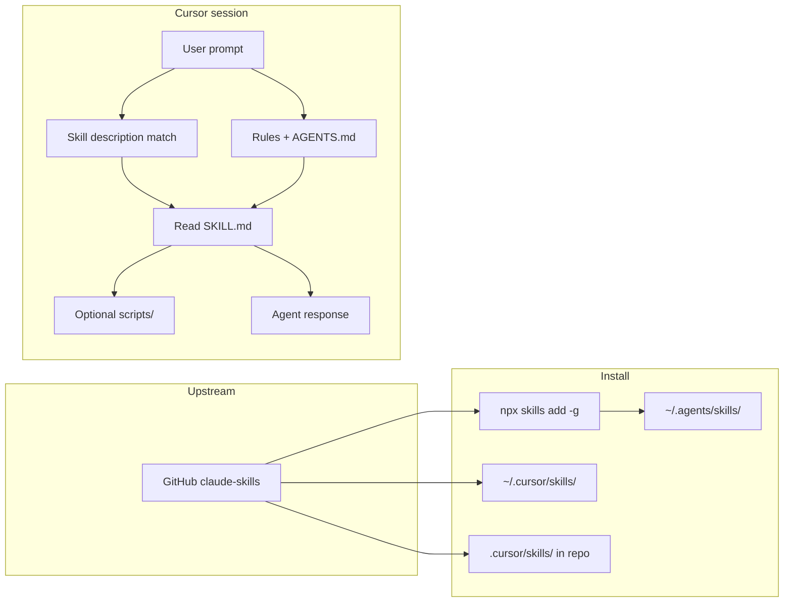

# alirezarezvani/claude-skills

**A Structured Study Packet**  
Built with an 8-principle learning method

---

## How to use this packet

This packet teaches the **claude-skills** ecosystem: what the [alirezarezvani/claude-skills](https://github.com/alirezarezvani/claude-skills) repository is, how **agent skills** work, how to use them in **Cursor** on Windows (including your install via `npx skills add … -g -y` into `~/.agents/skills/`), which domains the library covers, and how to install and update safely.

Content is drawn from the upstream README (v2.9.x line, **338** skills advertised), your local install (~**309–349** folders depending on release slice), and Cursor/agent conventions used in this `laravel13.x` repo.

**Audience:** professional developer brushing up — assumes you already use AI coding agents.

**Step 1 — Understanding** (Principles 1–4): build a correct mental model.  
**Step 2 — Automaticity** (Principles 5–8): quizzes, spacing, mixing, and overlearning so you can recall workflows under pressure.

### The 8 principles

| # | Principle | What you do |
|---|-----------|-------------|
| 1 | Map of the system | See how parts connect |
| 2 | Clear explanations | Learn core ideas in plain language |
| 3 | Different media | Same ideas as summary, diagram, analogy, table |
| 4 | Short lessons | Bite-sized micro-lessons |
| 5 | Test yourself | Quiz + flashcards + answer key |
| 6 | Wait to review | Spaced repetition schedule |
| 7 | Mix it up | Interleaved quiz |
| 8 | Don't stop | Overlearning plan |

### Table of contents

- [Step 1 — Understanding](#step-1--understanding)
  - [Principle 1 — Map of the system](#principle-1--map-of-the-system)
  - [Principle 2 — Clear explanations](#principle-2--clear-explanations)
  - [Principle 3 — Different media](#principle-3--different-media)
  - [Principle 4 — Short lessons](#principle-4--short-lessons)
- [Step 2 — Automaticity](#step-2--automaticity)
  - [Principle 5 — Test yourself](#principle-5--test-yourself)
  - [Principle 6 — Wait to review](#principle-6--wait-to-review)
  - [Principle 7 — Mix it up](#principle-7--mix-it-up)
  - [Principle 8 — Don't stop](#principle-8--dont-stop)
- [Appendix — Glossary](#appendix--glossary)

---

# Step 1 — Understanding

Your goal: a simple, accurate picture of how a third-party skill library plugs into Cursor (and other agents), what lives inside each skill folder, and how you invoke expertise without re-prompting from scratch every session.

---

## Principle 1 — Map of the system

### Install and discovery flow (typical Cursor path)

| Stage | What happens | Where it lives |
|-------|----------------|----------------|
| 1. Source | Open-source repo publishes skill folders + optional Python tools | `github.com/alirezarezvani/claude-skills` |
| 2. Install | CLI copies or links skills into a global skills directory | `~/.agents/skills/` (your `npx skills add … -g -y`) |
| 3. Discovery | Cursor (and compatible agents) load skill metadata from configured paths | Also `~/.cursor/skills/`, project `.cursor/skills/`, `.claude/skills/` per tool |
| 4. Trigger | User message or agent rules match skill `description` / name | Agent reads `SKILL.md` and follows workflow |
| 5. Execute | Agent applies instructions; may run bundled stdlib Python scripts | `scripts/` inside skill folder |
| 6. Update | Re-run installer or pull repo; semver patch = non-breaking | `CHANGELOG.md`, `npx skills add` again |

### Ecosystem components

| Component | Responsibility | Example |
|-----------|----------------|---------|
| **Skill** | Single-domain playbook (`SKILL.md` + optional assets) | `senior-architect`, `seo-audit`, `filament-pro` |
| **Agent** | Task-focused sub-agent definition (what to do) | Security audit runner, PM agent |
| **Persona** | Voice + priorities + curated skill loadout | `startup-cto`, `growth-marketer` |
| **Plugin bundle** | Claude Code marketplace grouping of many skills | `engineering-skills@claude-code-skills` |
| **Python tool** | Deterministic CLI helper (stdlib-only) | `skill_security_auditor.py` |
| **Converter** | Maps skills to other tools’ formats | `scripts/convert.sh`, `install.sh --tool cursor` |

### Domain map (16 areas, upstream README)

| Domain | ~Skills | You might invoke when… |
|--------|---------|-------------------------|
| Engineering — Core | 51 | Architecture, QA, DevOps, Playwright, a11y |
| Engineering — POWERFUL | 78 | RAG, MCP builder, chaos engineering, K8s operator |
| Product | 17 | PRD, roadmap, UX research, landing pages |
| Marketing | 46 | SEO, AEO, CRO, paid social, content pipeline |
| Productivity | 6 | Capture, email triage, handoff, reflect |
| Research (academic) | 8 | Lit review, grants, patent, syllabus |
| Research Operations | 5 | Clinical, market, product research ops |
| Project Management | 9 | Jira, Confluence, senior PM |
| Regulatory & QM | 18 | ISO 13485, MDR, FDA, GDPR |
| Compliance OS | 9 | Controls, evidence, audit readiness |
| C-Level Advisory | 66 | CFO/CMO/CRO personas, `/cs:*` commands |
| Business & Growth | 5 | CS, sales engineer, revenue ops |
| Business Operations | 7 | Process mapper, vendor management |
| Commercial | 8 | Deal desk, pricing strategist |
| Finance | 4 | DCF, SaaS metrics coach |
| Marketing (top-level `landing`) | 1 | Single-file HTML landing generator |

*Counts are from upstream marketing; your global install may list fewer folders if the CLI installs a subset or upstream version differs.*

### Map takeaway

> **Skills are files on disk, not magic in the model.** The agent only gets expertise when (a) the skill is installed where your tool looks, and (b) your prompt or rules cause that skill to be read. Install path + trigger wording are the two levers you control.

---

## Principle 2 — Clear explanations

### What is alirezarezvani/claude-skills?

An MIT-licensed, open-source **library of agent skills** (instruction packages) for coding and business workflows. Each skill is a folder meant to be reused across sessions. The repo also ships **agents**, **personas**, **slash commands** (especially in the C-level bundle), and **533 stdlib-only Python CLI tools** that skills can reference.

### What is an agent skill (in this ecosystem)?

A **skill** is a directory whose contract is defined by [agentskills.io](https://agentskills.io)-style **`SKILL.md`**: YAML frontmatter (`name`, `description`) plus procedural instructions, checklists, and links to `references/`, `scripts/`, and `assets/`. The **description** field is the primary discovery hook—the agent uses it to decide “this skill applies to the user’s request.”

### How is a skill different from an agent or persona?

| Kind | Answers | Neutral vs personality |
|------|---------|------------------------|
| **Skill** | “What steps and checks for this domain?” | Neutral procedure |
| **Agent** | “What job am I running end-to-end?” | Professional task focus |
| **Persona** | “Who am I being while I think?” | Distinct voice and priorities |

You can stack them: e.g. **persona** `startup-cto` + **skill** `senior-architect` + **skill** `aws-solution-architect` for an architecture review.

### How did your install work (`npx skills add … -g -y`)?

The **skills CLI** (agentskills ecosystem) pulled the GitHub repo and installed skill folders **globally** into `~/.agents/skills/` without prompting (`-y`). **`-g`** means global, not project-local. Cursor’s agent can consume skills from this path alongside personal skills in `~/.cursor/skills/` (see `docs/CURSOR_SKILLS_SYNC.md` in this repo for Spec-Kit, OpenSpec, Superpowers—those are separate from claude-skills).

### How do you use skills in Cursor?

1. **Confirm install:** `ls ~/.agents/skills | wc -l` (you should see hundreds of directories).
2. **Invoke explicitly** in chat, e.g. `Use the senior-architect skill: review our API boundary between checkout and webhooks.`
3. **Let descriptions auto-match** when your request clearly fits (e.g. “SEO audit” → `seo-audit`).
4. **Combine with repo rules:** `.cursor/rules/` and `AGENTS.md` still apply; skills add domain depth on top.
5. **Optional project mirror:** For team consistency, copy selected skills into `.cursor/skills/` inside a project (this repo mirrors *personal* triad skills under `.cursor/skills/`, not the full 300+ pack).

**Do not** write to `~/.cursor/skills-cursor/` (Cursor built-ins only).

### What about Claude Code plugins vs global skills?

**Claude Code** can install the same content as versioned **plugins** via `/plugin marketplace add alirezarezvani/claude-skills` and `/plugin install …@claude-code-skills`. That path is native to Anthropic’s plugin UI. **Cursor** users often prefer `npx skills add` or `scripts/install.sh --tool cursor` which materializes rules/skills in Cursor-native layouts. Same intellectual property, different packaging.

### What’s in a skill folder?

Typical layout:

```text
skill-name/
├── SKILL.md          # Required: frontmatter + workflow
├── scripts/          # Optional: Python CLI tools
├── references/       # Optional: templates, checklists
├── assets/           # Optional: static files
└── README.md         # Optional: human docs
```

### What are the Python tools for?

Reproducible calculations and checks (metrics, security scan of a skill, RICE prioritization) that should not be left to probabilistic guessing. All advertised tools use **Python stdlib only**—no `pip install` for consumers.

### How do you update without breaking workflows?

Upstream claims **semver** with patch releases that do not break `SKILL.md` structure or script CLI flags. Practical update loop:

```bash
# Refresh global install (same command you used)
npx skills add alirezarezvani/claude-skills -g -y

# Or git-based manual path
git clone https://github.com/alirezarezvani/claude-skills.git
cd claude-skills && git pull
```

For **Cursor-specific `.mdc` conversion**, upstream documents:

```bash
./scripts/convert.sh --tool all
./scripts/install.sh --tool cursor --target /path/to/project
```

Re-run after major upgrades if you rely on converted rules rather than `~/.agents/skills/`.

### Should you audit third-party skills before trusting them?

Yes for high-risk environments. The repo ships **`skill-security-auditor`**:

```bash
python3 engineering/skill-security-auditor/scripts/skill_security_auditor.py /path/to/skill/
```

It reports PASS / WARN / FAIL for injection, exfiltration, and supply-chain patterns.

### Explanation takeaway

> **Core idea:** claude-skills is a portable library of `SKILL.md` playbooks; Cursor uses them when they are on disk and your request triggers them.  
> **Common misconception:** “Installing skills replaces my Cursor rules or Spec-Kit.” It **does not**—it **adds** optional domain experts; your repo governance (constitution, OpenSpec, TDD) stays separate.

---

## Principle 3 — Different media

### One-line summary

**claude-skills** is a multi-tool skill marketplace in Git form: hundreds of `SKILL.md` packages, optional Python tools, and personas—installed globally (your `~/.agents/skills/`) and invoked in Cursor by naming the skill or matching its description.

### Mermaid diagram (discovery → execution)



### Analogy

Think of skills as **labeled playbooks in a locker room**: the coach (agent) still decides the game plan (your task), but when you say “run the red-zone offense” (invoke `playwright-pro`), they pull one binder instead of improvising from memory. Personas are **which coach voice** you want; agents are **pre-assigned drills**; skills are **the binders**.

### Comparison table (often confused)

| Concept | claude-skills global install | This laravel13.x repo |
|---------|------------------------------|------------------------|
| Purpose | Broad domain expertise (300+ skills) | Laravel examples + Spec-Kit/OpenSpec triad |
| Location | `~/.agents/skills/` | `.cursor/skills/` (8 personal skills) |
| Install command | `npx skills add alirezarezvani/claude-skills -g -y` | `cp -r .cursor/skills/* ~/.cursor/skills/` |
| Greenfield MVP | Use domain skills as helpers | **spec-kit** + **superpowers** (required workflow) |
| Post-MVP change | e.g. `filament-pro`, `seo-audit` | **openspec** `/opsx:*` |
| Output format | Varies per skill | Governed by constitution / specs |

### Media takeaway

> If you can draw **GitHub → global folder → prompt → SKILL.md** from memory, you will not confuse “I installed skills” with “the agent automatically knows everything.”

---

## Principle 4 — Short lessons

**Lesson 1 — One repo, many tools**  
The same skill source targets Claude Code, Codex, Gemini CLI, Cursor, Windsurf, Aider, and others via native install or `convert.sh`.

**Lesson 2 — SKILL.md is the contract**  
Frontmatter `description` is marketing + routing; body is the procedure you want the agent to follow literally.

**Lesson 3 — Your install is global**  
`-g` puts skills under `~/.agents/skills/`, shared across projects on this machine until you reinstall or remove folders.

**Lesson 4 — Cursor has multiple skill homes**  
Agents may read `~/.agents/skills/`, `~/.cursor/skills/`, and project `.cursor/skills/`; know which you rely on so you do not duplicate or edit the wrong copy.

**Lesson 5 — Invoke by name when it matters**  
For high-stakes work (security, compliance, finance), say `Use skill-security-auditor` or `Use mdr-745-specialist` so the right playbook loads.

**Lesson 6 — POWERFUL tier = depth**  
Skills like `rag-architect`, `mcp-server-builder`, and `skill-security-auditor` include scripts and references—worth reading `SKILL.md` once before first use.

### Short-lessons takeaway

> Six habits: confirm path, name the skill, read SKILL.md once for POWERFUL tools, keep triad workflow for this repo, re-run `npx skills add` to update, audit untrusted skills before production secrets.

---

# Step 2 — Automaticity

Understanding fades without retrieval. Use the quiz, flashcards, schedule, and mixed quiz below.

---

## Principle 5 — Test yourself

### Quiz (12 questions)

1. What file defines a skill’s machine- and human-readable contract?  
2. Name the three artifact types compared in the README (skills vs agents vs personas).  
3. Where did your global install place skill folders on this machine?  
4. What flag on `npx skills add` means global install?  
5. Which directory in Cursor must you avoid writing to?  
6. How do you explicitly invoke a skill in Agent chat?  
7. What does the `skill-security-auditor` script return?  
8. Name two engineering POWERFUL skills from the README table.  
9. How many domains does the README “Skills Overview” table list?  
10. What is the Claude Code marketplace add command (first step)?  
11. Does installing claude-skills replace Spec-Kit/OpenSpec in laravel13.x?  
12. What is the documented Cursor conversion install script pattern?

### Answer key

1. **`SKILL.md`** (with YAML frontmatter).  
2. **Skills** (how), **agents** (what task), **personas** (who/voice).  
3. **`~/.agents/skills/`** (per your install).  
4. **`-g`**.  
5. **`~/.cursor/skills-cursor/`** (built-ins only).  
6. e.g. **`Use the senior-architect skill: …`** or natural language that matches the skill description.  
7. **`PASS` / `WARN` / `FAIL`** with remediation guidance.  
8. Any two of: e.g. **`rag-architect`**, **`mcp-server-builder`**, **`ci-cd-pipeline-builder`**, **`api-design-reviewer`**, **`skill-security-auditor`**.  
9. **16** domain rows in the overview table (plus top-level `landing`).  
10. **`/plugin marketplace add alirezarezvani/claude-skills`**.  
11. **No** — they complement; greenfield/post-MVP workflows in this repo stay on spec-kit/openspec/superpowers.  
12. **`./scripts/convert.sh --tool all`** then **`./scripts/install.sh --tool cursor --target <path>`**.

### Flashcards

| Front | Back |
|-------|------|
| Skill contract file? | `SKILL.md` |
| Global install path (your setup)? | `~/.agents/skills/` |
| Global flag? | `-g` on `npx skills add` |
| Skill vs agent? | How vs what task |
| Skill vs persona? | Procedure vs voice/identity |
| Python deps for tools? | Stdlib only (no pip) |
| Security scan skill? | `skill-security-auditor` |
| C-level slash prefix? | `/cs:*` (21 commands in bundle) |
| Marketing pods count? | 8 pods in marketing-skill |
| AEO skill focus? | Answer Engine Optimization / LLM citation |
| Update same CLI? | `npx skills add alirezarezvani/claude-skills -g -y` |
| Cursor built-ins dir? | `~/.cursor/skills-cursor/` (read-only) |
| Repo license? | MIT |
| Orchestration doc? | `orchestration/ORCHESTRATION.md` |
| Persona example? | `startup-cto`, `growth-marketer`, `solo-founder` |

---

## Principle 6 — Wait to review

| When | What to do | Done |
|------|------------|------|
| **Today** | Skim Principle 1 tables; list 5 skills you will use this week | ☐ |
| **Day 1** | Quiz (Principle 5) closed-book; fix misses | ☐ |
| **Day 3** | Flashcards until 3 perfect rounds; open one `SKILL.md` end-to-end | ☐ |
| **Day 7** | Mixed quiz (Principle 7); run `ls ~/.agents/skills \| wc -l` | ☐ |
| **Day 14** | Invoke 2 skills in real Cursor tasks; note which triggered automatically | ☐ |
| **Day 30** | Re-run `npx skills add … -g -y`; read upstream CHANGELOG for breaking notes | ☐ |

Spacing works because each gap forces **retrieval**, which strengthens memory more than re-reading the README once.

---

## Principle 7 — Mix it up

### Interleaved quiz (12 questions)

1. Which skill would you use for REST API linting and breaking-change detection?  
2. What orchestration pattern stacks personas across weeks without a framework?  
3. Name a regulatory skill domain for medical devices (EU).  
4. What does `-y` on `npx skills add` do?  
5. Where are personal **Spec-Kit** skills mirrored in laravel13.x?  
6. How many Python CLI tools does upstream claim?  
7. Which marketing skill pod covers LLM citation optimization?  
8. What is BYO-sync tier for Hermes/Vibe?  
9. Name the productivity skill inspired by Matt Pocock for session continuity.  
10. After first quiz pass, what should you still do per Principle 8?  
11. What file in this repo documents triad skill sync across PCs?  
12. Does patch semver allow breaking SKILL.md structure per FAQ?

### Interleaved answer key

1. **`api-design-reviewer`**.  
2. **Solo Sprint** (switch personas by phase)—see Orchestration section.  
3. e.g. **`mdr-745-specialist`** / **Regulatory & QM** domain.  
4. **Non-interactive / assume yes** to prompts.  
5. **`.cursor/skills/`** → copy to `~/.cursor/skills/`.  
6. **533** (stdlib-only).  
7. **`aeo`** (Answer Engine Optimization).  
8. Pre-generated tree in repo; you run **sync script locally** (`sync-hermes-skills.py` or `vibe-install.sh`).  
9. **`handoff`** (productivity domain).  
10. **Overlearning**: flashcards, teach-back, monthly cold test—not stop at first pass.  
11. **`docs/CURSOR_SKILLS_SYNC.md`**.  
12. **No** for patch releases (backward compatible per FAQ).

Mixing trains you to **pick** the right subsystem (install vs invoke vs repo workflow vs security), not recite sections in order.

---

## Principle 8 — Don't stop

### Stages past first success

| Stage | Sign | Action |
|-------|------|--------|
| First correct | You pass the Principle 5 quiz once | Same day: 15 flashcards + pick 3 skills for real work |
| Comfortable | You explain install paths without looking | Day 3–7: mixed quiz + one POWERFUL `SKILL.md` deep read |
| Automatic | You choose skill vs OpenSpec vs Spec-Kit instantly | Monthly: cold-map install → trigger → execute; skim CHANGELOG |

### Overlearning plan

- **Catalog:** `ls ~/.agents/skills > ~/claude-skills-index.txt` and tag 10 you own professionally.  
- **Teach-back:** Explain to a teammate: “Skills vs plugins vs `.cursor/rules`.”  
- **Security habit:** Run `skill-security-auditor` on any skill you fork before adding secrets to prompts.  
- **Repo integration:** Keep using `docs/CURSOR_SKILLS_SYNC.md` for triad skills; use claude-skills for domain depth (e.g. `laravel-specialist`, `filament-pro`, `test-driven-development`).  
- **Monthly:** Re-run global install; diff skill count; read [CHANGELOG](https://github.com/alirezarezvani/claude-skills/blob/main/CHANGELOG.md).

### Final takeaway

> **Step 1** gave you the map (repo → disk → Cursor → SKILL.md). **Step 2** makes it stick: retrieval, spacing, mixed practice, and continued use after the first correct answer. Permanent skill is knowing **where** expertise lives and **how** to load it on demand.

---

## Appendix — Glossary

| Term | Definition |
|------|------------|
| **Agent skill** | Folder with `SKILL.md` that extends an AI agent with domain procedures. |
| **SKILL.md** | Frontmatter + instructions; primary contract per agentskills.io style. |
| **claude-skills** | GitHub repo `alirezarezvani/claude-skills` (MIT). |
| **Global install** | Skills on disk for all projects (`-g` → `~/.agents/skills/`). |
| **Persona** | Cross-domain identity file with voice and skill loadout. |
| **Plugin (Claude Code)** | Marketplace bundle installing skills via `/plugin install`. |
| **POWERFUL tier** | Advanced skills with scripts, references, deep workflows. |
| **Orchestration** | Patterns (Solo Sprint, Domain Deep-Dive, etc.) to combine skills/personas. |
| **AEO** | Answer Engine Optimization—content cited by LLM answer engines. |
| **skill-security-auditor** | Pre-install security scanner for skill folders. |
| **convert.sh** | Upstream script to emit tool-specific skill formats. |
| **Triad (this repo)** | spec-kit + openspec + superpowers personal skills. |
| **Spec-Kit** | Greenfield SDD pipeline (`/speckit.*`) for `examples/*` MVPs. |
| **OpenSpec** | Post-MVP change workflow (`/opsx:*`) in laravel13.x. |

### Further study

- Upstream README: [github.com/alirezarezvani/claude-skills](https://github.com/alirezarezvani/claude-skills)  
- Multi-tool integrations: [alirezarezvani.github.io/claude-skills/integrations/](https://alirezarezvani.github.io/claude-skills/integrations/)  
- This repo: `docs/CURSOR_SKILLS_SYNC.md` — personal triad skills sync  
- Orchestration protocol: upstream `orchestration/ORCHESTRATION.md`  
- Factory for authoring skills: [claude-code-skills-agents-factory](https://github.com/alirezarezvani/claude-code-skills-agents-factory)

---

*Packet version: 2026-06-05 — aligned with upstream README claiming 338 skills; local install count may differ.*
