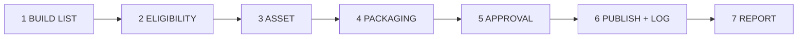

# Creator Operator — UX / UI map

**App:** `examples/creator-operator-v1` · **URL:** http://creator-operator-v1.test  
**Aligned with:** [Creator Commission spec](../../../docs/superpowers/specs/2026-06-13-creator-commission-tiktok-first-design.md) · [Pilot kit](../../../docs/creator-commission/README.md) · [Weekly batch checklist](../../../docs/creator-commission/weekly-batch-checklist.md)

This is **not** a consumer storefront (see `marketplace-v2/docs/DESIGN.md`). Creator Operator is an **ops console**: batch workflow, approval queue, publish log, settlement — the Google Sheet tabs rendered as role-aware UI.

---

## Personas & jobs

| Persona | Job | Primary screens | Doc anchor |
|---------|-----|-----------------|----------|
| **Operator** | Run weekly batch per creator; package metadata; publish after approval | Dashboard, creator hub, publish log forms | `weekly-batch-checklist.md` steps 1–6 |
| **Creator** | Approve or skip packaged videos in 24–48h; trust transparency | Approval inbox | Spec § Asset Workflow step 5; Lite tier = approve all |

**Trust UX (Segment A):** show TikTok source link, proposed title, operator notes; never imply operator owns the channel. Copy uses **approve / skip**, not “buy” or “checkout”.

---

## Operational page flow (source of truth)

Maps spec § Weekly batch loop + checklist sections:



| Step | Checklist | Portal today | CSV / tab |
|------|-----------|--------------|-----------|
| 1 BUILD LIST | New TikTok URLs since `last_run_date` | Operator dashboard + creator `last_run_date` | — (Slice 3: CLI import) |
| 2 ELIGIBILITY | Music policy, on-brand, not duplicate | Edit row → status `skipped_*` | `publish-log.status` |
| 3 ASSET | Clean file received | Creator onboarding notes + packaging `notes` | Onboarding tab (Sheet) |
| 4 PACKAGING | YT title, IG caption in notes | **Add publish row** form | `title_variant`, `notes` |
| 5 APPROVAL | Creator 24–48h | **Creator approvals** inbox | `pending_approval` → `approved` |
| 6 PUBLISH + LOG | Live URLs + IDs | **Mark published** on edit | `yt_url`, `ig_url`, `posted_time` |
| 7 REPORT | Weekly light + monthly settlement | **Built** — metrics + settlement tabs + creator reports | `weekly-metrics`, `monthly-settlement` tabs |

---

## Publish log status (state machine)

Matches [README status table](../../../docs/creator-commission/README.md#publish-log-status-values):

```
pending_approval ──approve──► approved ──mark published──► published
       │                           │
       └── skip (creator) ──► skipped_creator
       └── skip (music)   ──► skipped_music  (operator, step 2)
       └── failure        ──► error
```

| Status | UI badge | Who sets | Next action |
|--------|----------|----------|-------------|
| `pending_approval` | Amber | Operator (step 4) | Creator approves |
| `approved` | Sky | Creator or operator | Operator publishes |
| `published` | Emerald | Operator (step 6) | Metrics (slice 1) |
| `skipped_music` | Stone | Operator | None |
| `skipped_creator` | Stone | Creator (Skip button) | None |
| `error` | Red | Operator | Fix + republish |

---

## Information architecture

```
/  (guest)          Welcome — what this portal is; Log in
/login              Dev prefill; operator vs creator demo accounts

── Operator (role:operator) ──
/operator           Batch queue dashboard — KPIs + recent log
/operator/creators  Roster — handle, tier, pending count
/operator/creators/{id}   Creator hub — onboarding summary + publish log table
/operator/creators/{id}/publish-log/create   Step 4 packaging
/operator/creators/{id}/publish-log/{id}/edit   Edit + step 6 publish
/operator/creators/{id}/metrics        Step 7 weekly metrics (list)
/operator/creators/{id}/metrics/create Step 7 weekly metrics (form)
/operator/creators/{id}/settlement     Monthly settlement (list)
/operator/creators/{id}/settlement/create   Monthly settlement (form + formula preview)
/operator/creators/{id}/import         Step 1 BUILD LIST — JSONL paste + preview
/operator/billing                      Operator plan + creator limit (mock Track A)
/operator/integrations                 Outbound webhooks (n8n / Zapier)

── Creator (role:creator) ──
/creator/approvals  Step 5 inbox — pending + recent decisions
/creator/reports    Read-only weekly metrics
/creator/settlement Read-only monthly settlement statement
```

**Nav labels (doc-aligned):** Operator → **Batch queue** · **Creators** · **Billing** · **Integrations** · Creator → **Approvals** · **Reports** · **Settlement**

**Creator hub subnav (`x-creator-hub-nav`):** Publish log · Weekly metrics · Settlement · TikTok import

---

## Design tokens (ops console)

**UI pass:** 2026-06-15 — full polish; CSS utilities in `resources/css/app.css` (`.ops-*`).

Borrow admin patterns from [Flowbite application blocks](https://flowbite.com/blocks/application/) — dense tables, status pills, no marketing hero.

| Token | Value | Use |
|-------|--------|-----|
| Page bg | `stone-50` (`.ops-shell`) | Operator/creator shells |
| Panel | `.ops-panel` — white, `rounded-xl`, `shadow-panel`, `border-stone-200/80` | Tables, forms |
| Primary action | `.ops-btn-primary` — `stone-900` | Operator CTAs |
| Secondary | `.ops-btn-secondary` | Cancel, Skip |
| Links | `.ops-link` — `indigo-600` | In-table / header actions |
| Success publish | `.ops-btn-success` + emerald fieldset | Mark published block |
| Flash success | `.ops-flash-success` | Session status |
| Flash warn | `.ops-flash-warn` | Dev login, mock billing, CLI missing |
| Dev banner | Collapsible `Demo accounts` on login | Local prefill only |
| Font | **Instrument Sans** (Bunny Fonts) | Replaces Figtree in layouts |
| Focus | `focus-visible:ring-indigo-500` | Buttons, inputs, nav |

**Status colors:** `x-publish-status` — ring-inset pills (amber / sky / emerald / stone / red).

**Inspiration (2026-06-15):** Flowbite admin KPI grid + dense tables; Page Flows approval card list pattern on creator inbox.

---

## Page specs (MVP built)

### Welcome `/`

| Element | Content |
|---------|---------|
| Headline | Creator Operator — TikTok-first cross-post ops |
| Sub | Operator runs weekly batch; creators approve before publish |
| CTA | Log in (dev accounts documented on login page) |
| Avoid | Default Laravel marketing SVG |

### Operator dashboard `/operator`

| Element | Maps to |
|---------|---------|
| KPI cards | Creators · Pending approval · Ready to publish · Published (7d) |
| **7-day charts** | Publish velocity (by `posted_time`) · Pending queue (by `logged_on`) |
| **Pending by creator** | Horizontal bar list when any creator has pending rows |
| Batch loop rail | Full 7-step reminder (highlight: queue health) |
| Recent publish log | Cross-creator slice with **TikTok thumb** column |
| Actions | All creators · Onboard creator (= onboarding runbook week 0) |

### Creator hub `/operator/creators/{id}`

| Element | Maps to |
|---------|---------|
| Header meta | Tier · Music policy · Last run date |
| Status filter chips | Filter publish log by status |
| Publish log table | Sheet tab **Publish log** columns (subset in UI) |
| Empty state | “Add from weekly batch step 4 (packaging)” |

### Add publish row (step 4)

| Field | CSV column | Required |
|-------|------------|----------|
| Log date | `date` | Yes |
| TikTok URL | `tiktok_url` | Yes |
| Proposed title (YT / SEO) | `title_variant` | Recommended |
| Packaging notes | `notes` (YT desc, IG caption, tags) | Optional |
| Default status | `pending_approval` | Auto |

### Edit / publish (steps 4–6)

| Field | CSV column | When |
|-------|------------|------|
| Status dropdown | `status` | Eligibility skips, corrections |
| YT / IG URLs | `yt_url`, `ig_url` | Before/after publish |
| YouTube video ID | `yt_video_id` | Edit + publish |
| Posted time | `posted_time` | Edit + publish |
| 7d views | `views_yt_7d`, `views_ig_7d` | Edit |
| IG packaging callout | notes structure | Step 4 fieldset on edit |
| Mark published form | sets `published` + `last_run_date` | Step 6 only if `approved` |

### Creator approvals `/creator/approvals`

| Element | Maps to |
|---------|---------|
| Pending cards | **TikTok thumb** (`x-tiktok-thumb`) · title · date · source link · notes |
| Mobile actions | Sticky `.ops-approval-actions` · `.ops-btn-touch` (48px tap targets) |
| Approve | → `approved` |
| Skip | → `skipped_creator` (not “Reject”) |
| Recent decisions | Last non-pending rows with thumb column |

---

## Gap matrix (post Mode D W1–W6)

| Gap | Status |
|-----|--------|
| Weekly metrics UI | **Built** (Slice 1) |
| Monthly settlement / S÷T formula UI | **Built** (Slice 2) |
| BUILD LIST JSONL import | **Built** (Slice 3) |
| Packaging IG-specific fields | **Built** — notes + IG fieldset on edit |
| `posted_time`, `yt_video_id`, 7d views in UI | **Built** |
| Onboarding tab fields split across creator form | OK |
| Interactive batch checklist on dashboard | **Partial** — KPI + 7-day charts (2026-06-15 audit) |
| TikTok preview thumbs | **Built** — oEmbed cache + `tiktok_thumbnail_url` |
| Approval batch email | **Built** — `ApprovalBatchReadyMail` on new pending rows |
| Operator billing (mock plan + limit) | **Built** (Slice 4 Track A) |
| Live Stripe portal | **OOS** Track B |
| n8n webhooks | **Built** (Slice 5) |
| CSV export download | **OOS** |
| Weekly email report | **OOS** (approval batch email **built** 2026-06-15) |

---

## Next slices — UX map

### Slice 1 — Weekly metrics

**Doc:** `templates/weekly-metrics.csv` · checklist § REPORT (weekly light)

| Route | Screen |
|-------|--------|
| `/operator/creators/{id}/metrics` | Weekly rows: `week_start`, `videos_published`, `best_video_*`, `experiment`, `experiment_result`, `operator_notes` |
| `/operator/creators/{id}/metrics/create` | Post-batch summary form (operator fills after step 6) |
| `/creator/reports` (optional) | Read-only weekly snapshot email preview |

**UX:** One row per batch week; link `best_video_url` to publish log row; show experiment as callout card on creator hub.

**Acceptance:** Operator can record week 1 pilot metrics without opening Google Sheets.

---

### Slice 2 — Monthly settlement

**Doc:** `templates/monthly-settlement.csv` · spec § Attribution formula

| Route | Screen |
|-------|--------|
| `/operator/creators/{id}/settlement` | Table: period, platform, payout, **S**, **T**, attributed revenue, commission %, ops fee, creator net |
| `/operator/creators/{id}/settlement/create` | Form with live formula preview: `attributed = gross × (S/T)` |
| `/creator/settlement/{period}` | Read-only statement; **Confirmed** vs **Estimated** badges |

**UX:** Formula block always visible when editing (trust). Export CSV matching template. Dispute window note in footer (14 days per spec).

**Acceptance:** Monthly row matches README settlement formulas; creator sees same numbers.

---

### Slice 3 — TikTok CLI import (BUILD LIST)

**Doc:** checklist § 1 · `tools/tiktok-metadata/README.md`

| Route | Screen |
|-------|--------|
| `/operator/creators/{id}/import` | Paste TikTok profile URL or upload CLI JSON; preview candidate URLs since `last_run_date` |
| Action | Bulk “Add as draft” → publish log rows (status `pending_approval` or draft state) |

**UX:** Step 1 highlighted on batch rail; diff view “new since last run”; music policy warning per row.

**Acceptance:** Operator imports ≥1 URL without manual copy from TikTok app.

---

### Slice 4 — Membership / billing (operator SaaS)

**Doc:** Not in creator commission pilot — pattern from `examples/billing-saas` (Cashier)

| Route | Screen |
|-------|--------|
| `/operator/billing` | Operator org plan (how many creators, tiers) |
| `/settings/subscription` | Stripe portal link |

**UX:** Separate from creator commission invoice — this is **software** billing for the operator using the portal, not the 15–20% creator settlement.

**Acceptance:** Gated creator count or export; Stripe test mode checkout.

---

### Slice 5 — Automation vault (n8n)

**Doc:** Internal tooling boundary in spec — webhooks only, not full n8n UI

| Route | Screen |
|-------|--------|
| `/operator/integrations` | Webhook URLs + event toggles: `publish_log.approved`, `publish_log.published` |
| Docs link | Governance: no auto-publish without approval on Lite tier |

**UX:** Copy webhook URL; test ping; no embedded workflow editor.

**Acceptance:** External n8n flow receives JSON payload on approve event.

---

## Components

| Component | Use |
|-----------|-----|
| `x-batch-loop-rail` | 7-step horizontal stepper; `:current="4"` |
| `x-publish-status` | Status pill — colors match state machine |
| `x-ops-panel` | White card with optional `:title` header |
| `x-flash` | Session success + validation error banner |
| `x-empty-state` | Table/list empty rows with title + copy |
| `.ops-kpi` / `.ops-kpi-grid` | Dashboard KPI cards |
| `.ops-chip-active` / `-inactive` | Status filters, creator hub subnav |
| Dev login banner | `auth/login` — `.ops-callout-dev` |

---

## Inspiration (patterns only)

| Source | Borrow |
|--------|--------|
| [Page Flows](https://pageflows.com/) | Approval inbox layout (card list + primary/secondary actions) — **not** the product |
| [Flowbite admin](https://flowbite.com/blocks/application/) | KPI grid, dense tables, filter chips |
| Google Sheets publish log | Column order and status vocabulary |

**Do not:** marketplace catalog patterns, cart/checkout, vendor storefront chrome.

---

## Verification

- Operator can trace any screen to a checklist step (batch rail + headers).
- Creator sees only approval + (future) settlement read-only.
- Status labels match CSV exactly (`pending_approval`, not “Pending Review”).
- New slice work extends this doc with route + field table before implementation.
- Roadmap execution: [`ROADMAP.md`](ROADMAP.md) + zero-miss **Mode D** ([`docs/ZERO-MISS-97-TASK-ROADMAP-PROMPT.md`](../../../docs/ZERO-MISS-97-TASK-ROADMAP-PROMPT.md#mode-d--docs--ux--parallel-post-mvp-slices)) — matrix must cover every gap row and CSV column; **parallel waves** inside each wave.
