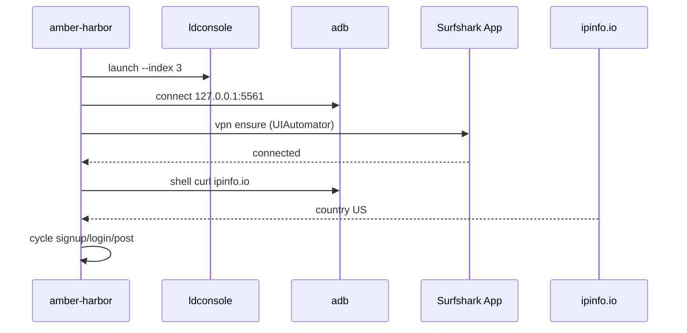

# Design: Fleet + VPN per LDPlayer instance

## Instance identity

| Field | Source |
|-------|--------|
| `index` | LDPlayer `list2` column 0 |
| `adbPort` | `5555 + index * 2` |
| `adbSerial` | `127.0.0.1:{adbPort}` or `emulator-{5554+2*index}` |
| `configPath` | `{ldHome}/vms/config/leidian{index}.config` |

## Why Android Surfshark (not host VPN)

Host-level Surfshark gives **one IP** to all emulators. TikTok farming needs **independent device fingerprints + IPs**. Each LDPlayer has its own Android network stack; Surfshark inside each emulator matches that model.

## VPN persistence strategy

1. **Clone-based (recommended):** Set up index 0 completely, then `ldconsole copy --from 0 --name farm-{i}`. Cloned `data.vmdk` retains Surfshark app login.
2. **Re-ensure on launch:** Even with persistence, `vpn ensure` checks UI state (disconnected after reboot is common) and reconnects USA in <30s.
3. **Permission:** First boot after fresh install (not clone) shows Android VPN dialog — automate OK tap once; store `vpnPermissionGranted: true` in fleet.json.

## Location verification

```bash
adb -s {serial} shell "curl -s --max-time 15 https://ipinfo.io/json"
```

Expected: `"country": "US"`. Also log `ip`, `city`, `org` to fleet registry for debugging.

If `curl` missing in emulator: `ldconsole installapp` busybox or use `am start -a android.intent.action.VIEW -d https://ipinfo.io/json` + WebView scrape (fallback).

## Resource budget (10–20 instances)

| Setting | Recommended |
|---------|-------------|
| Resolution | 720×1280 @ 240 DPI |
| RAM | 2048 MB per instance |
| CPU | 2 cores per instance |
| Concurrent running | Start with 5–10; scale after measuring host RAM |

Use `ldconsole modify --index N --resolution 720,1280,320 --memory 2048 --cpu 2`.

## Command flow diagram



## Files to add (on apply)

| File | Role |
|------|------|
| `Core/FleetRegistry.cs` | JSON persistence |
| `Core/FleetInstance.cs` | Per-index metadata |
| `Core/VpnOrchestrator.cs` | Surfshark UI automation |
| `Core/LocationVerifier.cs` | IP geo check |
| `Flows/FleetInitFlow.cs` | clone + configure |
| `Flows/VpnEnsureFlow.cs` | ensure + verify |
| `docs/FLEET_VPN.md` | operator runbook |

## Existing code to extend

- `LdPlayer.cs` — multi-index list, `modify` resolution, clone wrapper
- `AdbClient.cs` — serial from index
- `FarmSettings.cs` — `FleetSettings` nested object
- `CliRunner.cs` — new commands + `--index`
- `PreflightFlow.cs` — call location verify
